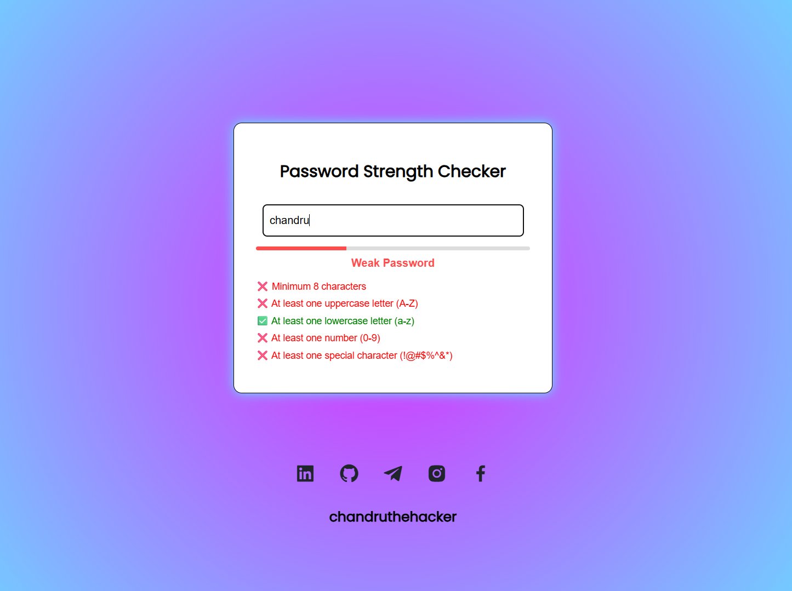

# 🔐 Password Strength Checker

This is a simple and interactive **Password Strength Checker** built with HTML, CSS, and JavaScript. It evaluates the strength of a password in real-time and provides visual and textual feedback to help users create strong, secure passwords.

---
### 🔗 Weblink: [Live Website](https://chandruthehacker.github.io/password-strength-checker)
---

## 🌟 Features

- Live password strength evaluation
- Visual meter with color indication (Weak, Moderate, Strong)
- Password requirements checklist
- Copy to clipboard button (only when password is strong)
- Responsive and clean UI
- Social media profile links (customized)

---

## 📸 Demo



> 📌 *Add a screenshot of your project in the repo and name it `demo-screenshot.png`.*

---

## 🔧 Tech Stack

- HTML5
- CSS3
- JavaScript (Vanilla)

---

## 📊 How It Works

The password is checked against 5 rules:
1. ✅ Minimum 8 characters
2. ✅ At least one uppercase letter (A-Z)
3. ✅ At least one lowercase letter (a-z)
4. ✅ At least one number (0-9)
5. ✅ At least one special character (!@#$%^&*)

The score determines:
- 🔴 Weak (0-2 rules passed)
- 🟡 Moderate (3-4 rules passed)
- 🟢 Strong (All 5 rules passed)

---

## 📌 Best Practices for Strong Passwords

- Use at least 12 characters
- Mix uppercase and lowercase letters
- Include numbers and special symbols
- Avoid common patterns (like `123456`, `password`, `qwerty`)
- Use passphrases (e.g., `Monkey$Dance7!`)
- Use a password manager for storage

---

## 🔐 Common Password Attacks

- **Brute Force Attack:** Tries all combinations to guess the password
- **Dictionary Attack:** Uses common word lists to guess passwords
- **Phishing:** Tricks users into revealing their password
- **Credential Stuffing:** Uses leaked usernames/passwords from other sites

---

## 🧠 Learnings from the Task

- Password length and complexity greatly impact strength
- Real-time feedback improves usability
- JavaScript DOM manipulation is powerful for form validation
- CSS animations enhance user experience

---

## ✅ Password Examples Tested

| Password          | Strength  |
|------------------|-----------|
| `pass123`        | Weak      |
| `Password1`      | Moderate  |
| `Pass@1234`      | Strong    |
| `XyZ!987654`     | Strong    |

---

## 🚀 How to Use

1. Clone or download this repository
2. Open `index.html` in any browser
3. Type a password and see feedback instantly
4. Copy strong passwords using the "Copy" button

---

## 🔗 Connect with Me

- [LinkedIn](https://www.linkedin.com/in/chandraprakash87/)
- [GitHub](https://github.com/chandruthehacker)
- [Telegram](https://t.me/chandruthehacker)
- [Instagram](https://www.instagram.com/dgl_chandru)
- [Facebook](https://www.facebook.com/chandru87125)

---

## 📁 Folder Structure
```txt
📦 password-strength-checker/
┣ 📜 index.html
┣ 📜 style.css
┣ 📜 script.js
┗ 📷 screenshot.png
```
